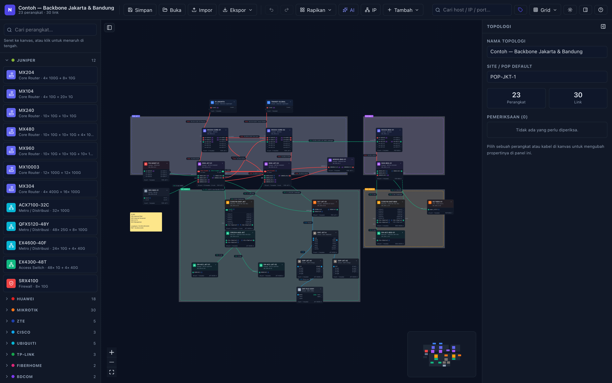
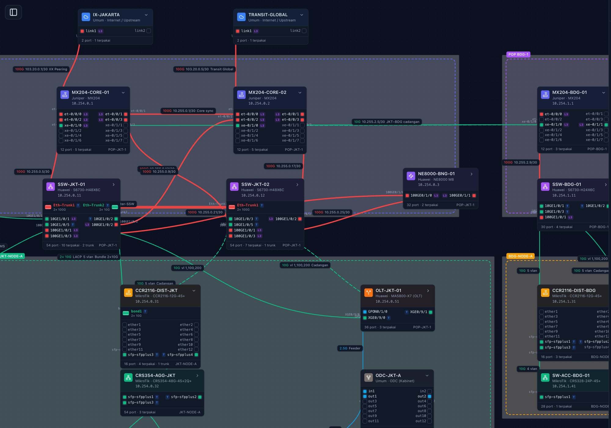
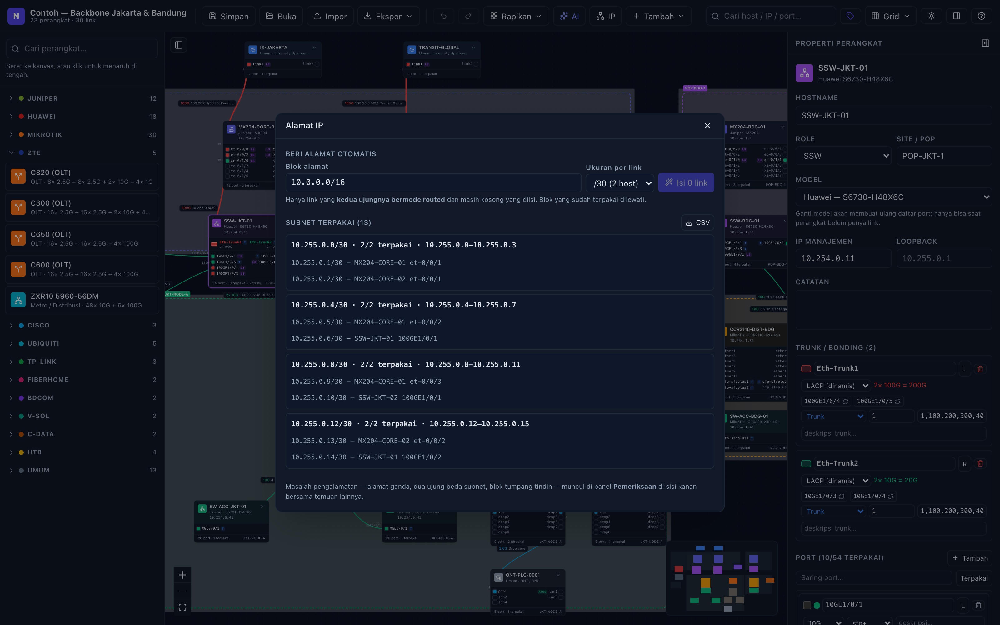
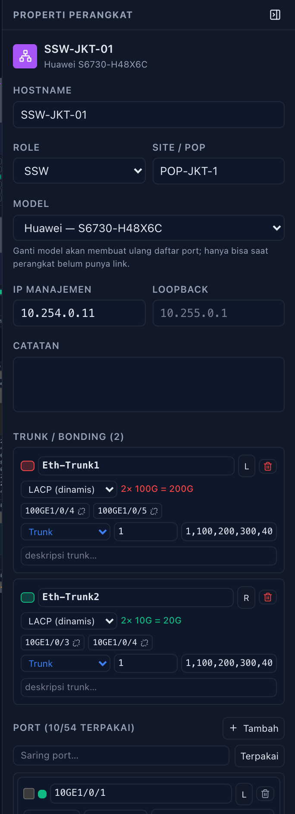
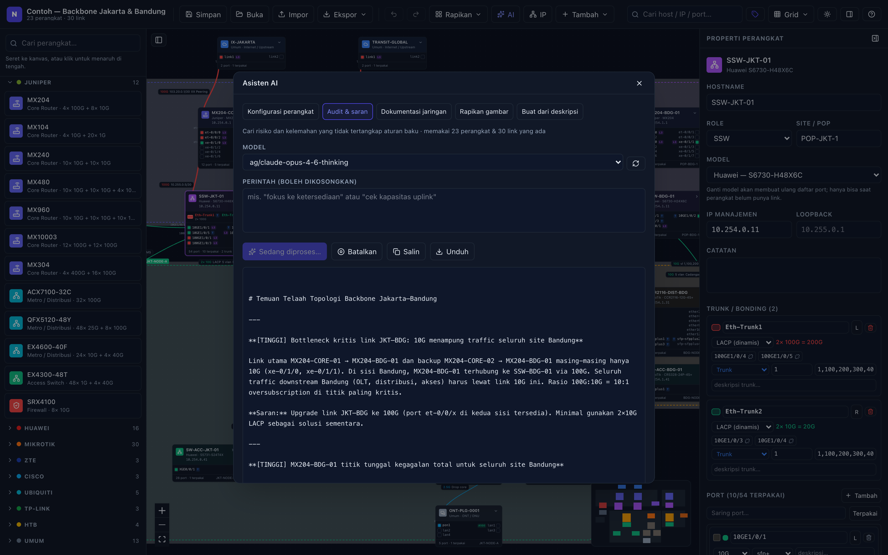
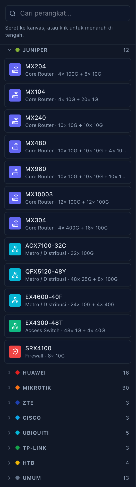

# NetTopo — Editor Topologi Jaringan

Aplikasi web untuk menggambar topologi jaringan sampai level **port-ke-port**,
dengan katalog perangkat yang sesuai jaringan ISP di Indonesia: **Juniper MX,
switch & SSW Huawei, MikroTik CRS dan CCR**.

Mendukung **link aggregation / bonding** — Eth-Trunk (Huawei), ae (Juniper),
bond (MikroTik) — lengkap dengan daftar port anggotanya, serta **VLAN dan
link-type per interface** (access / trunk / hybrid / routed) seperti di
perangkat aslinya.

Semua data disimpan di browser Anda sendiri (tidak ada server, tidak ada login),
dan bisa diekspor ke JSON, PNG, SVG, atau CSV.

---



---

## Menjalankan

**Prasyarat:** [Node.js](https://nodejs.org) versi **22.12+ atau 24 LTS**
(npm sudah termasuk). Periksa dengan `node -v`.

```bash
git clone https://github.com/Masamune21-dev/nettopo.git
cd nettopo
npm install
npm run dev
```

Buka <http://localhost:5173>. Selesai — tidak ada database yang perlu disiapkan
dan tidak ada server yang perlu dijalankan terpisah. Topologi tersimpan di
browser Anda sendiri; lihat [Format file JSON](#format-file-json) untuk
memindahkannya antar komputer.

| Perintah | Kegunaan |
|---|---|
| `npm run dev` | Server pengembangan dengan hot reload |
| `npm run build` | Build produksi ke `dist/` |
| `npm run preview` | Melihat hasil build produksi |
| `npm test` | Menjalankan unit test |
| `npm run test:watch` | Unit test mode watch |
| `npm run lint` | Pemeriksaan gaya kode |

Hasil `npm run build` berupa berkas statis di `dist/`, jadi bisa ditaruh di
web server mana pun (nginx, Apache, GitHub Pages) tanpa Node.js di sisi server.
Satu-satunya yang membutuhkan dev server adalah [asisten AI](#asisten-ai-opsional),
karena kunci API-nya sengaja ditahan di sisi server.

---

## Topologi contoh

Saat pertama dibuka, aplikasi memuat contoh jaringan ISP dua POP — **23
perangkat, 30 link** — yang bisa langsung diutak-atik atau dihapus lewat
**Buka → Topologi baru**:

- **Upstream ganda**: IIX peering dan transit internasional, masing-masing ke
  core yang berbeda
- **POP JKT-1**: sepasang MX204 saling silang ke dua SSW Huawei, BNG NE8000,
  firewall manajemen, dan server NMS
- **POP BDG-1**: MX204 dan SSW sendiri, tersambung ke Jakarta lewat jalur utama
  dan jalur cadangan yang terpisah
- **Eth-Trunk**: antar-SSW 2×100G, dan SSW ke distribusi MikroTik 2×10G
- **FTTH**: OLT Huawei MA5800 dan ZTE C320, lalu ODC → ODP → ONT pelanggan
- **VLAN**: 100 ritel, 200 korporat, 300 CCTV, 400 manajemen — konsisten dari
  tulang punggung sampai port pelanggan
- **13 subnet /30** untuk seluruh link L3



Di kanvas terbaca langsung: badge **L3** dan alamat `/30` pada link routed,
badge **T** untuk port bertag VLAN, Eth-Trunk beserta kapasitas gabungannya
(`2× 100G`), VLAN yang dibawa tiap kabel, dan rantai FTTH dari OLT turun ke ODC.

Contoh ini sekaligus jadi rujukan konfigurasi yang benar: ada test yang menjaga
agar ia selalu lolos **seluruh pemeriksaan tanpa satu pun peringatan** —
kecepatan kedua ujung cocok, VLAN sepadan, tiap link L3 satu subnet, tidak ada
port terpakai dua kali, dan tidak ada perangkat menggantung. Kalau suatu saat
ada aturan pemeriksaan baru yang membuatnya gagal, itu ketahuan langsung.

---

## Cara pakai

1. **Seret perangkat** dari panel kiri ke kanvas (atau klik untuk menaruh di tengah).
2. **Tarik kabel** dari kotak port kecil di sisi node ke port perangkat lain.
   Port yang sudah terpakai tidak bisa dipakai dua kali, dan bila kecepatan kedua
   port berbeda, link otomatis memakai yang lebih rendah.
3. **Klik perangkat atau kabel** untuk mengubah hostname, IP manajemen, nama port,
   VLAN, kecepatan, dan sebagainya di panel kanan.
4. Perangkat berport banyak (mis. CRS354 dengan 54 port) tampil ringkas — klik
   tanda **▸** di pojok node untuk menampilkan seluruh portnya.
5. **Rapikan** menyusun ulang topologi secara berjenjang (internet → core →
   SSW/agregasi → distribusi → akses), memindahkan tiap port ke sisi node yang
   menghadap perangkat lawannya, dan menyesuaikan kotak area agar tetap
   memeluk perangkat yang sama. Menu yang sama juga berisi **rata kiri/kanan/
   atas/bawah/tengah** dan **sebar merata** untuk objek yang sedang dipilih.
6. **Simpan** menyimpan ke browser; ada juga autosave setiap 1,5 detik setelah
   perubahan terakhir.
7. **Ekspor** ke PNG/SVG untuk laporan, JSON untuk cadangan, atau CSV untuk
   rekap. Ekspor CSV menghasilkan tiga berkas: `-perangkat.csv`, `-link.csv`,
   dan `-interface.csv` — yang terakhir berisi link-type, PVID, VLAN
   tagged/untagged, dan IP setiap interface.

### Menggeser kabel

Kabel tidak harus lurus dari port ke port:

1. **Klik kabelnya** di kanvas. Muncul titik-titik kecil di tengah tiap ruas.
2. **Klik titik kecil** itu untuk menambah belokan di situ.
3. **Geser** bulatan yang muncul untuk memindahkan belokan; **klik ganda** untuk
   menghapusnya. Satu kali geser = satu langkah undo.
4. Di panel kanan, **Gaya kabel** bisa diubah: *Lengkung* (bawaan), *Siku
   (orthogonal)* untuk diagram bergaya rak, atau *Lurus*. Tombol **Hapus
   belokan** membuang semua titik belok pada kabel itu.

### Membuat kabel benar-benar lurus

Kabel sering terlihat “hampir lurus tapi ada sikunya” karena kedua portnya
berbeda beberapa piksel: baris port di dalam node berjarak 12 px, sedangkan
node melompat mengikuti grid, jadi selisihnya jarang pas nol.

Menggambar ulang kabelnya tidak menolong — kedua ujungnya menempel di port.
Yang perlu digeser justru perangkatnya. Pilih kabelnya, lalu tekan
**Luruskan kabel** di panel kanan: salah satu perangkat digeser secukupnya
sampai kedua port sejajar, dan tombolnya berubah jadi “Kabel sudah lurus”.
Jumlah pikselnya ditulis di tombol; kalau lebih dari 100 px tombolnya berwarna
kuning sebagai peringatan bahwa tata letak akan berubah terlihat. Semua bisa
dibatalkan dengan `Cmd/Ctrl + Z`.

Ukuran grid sendiri bisa diganti lewat menu **Grid** di toolbar: 8, 16
(bawaan), 24, atau 32 px — sekaligus mengatur kerapatan titik latar.

Titik belok ikut tersimpan di file JSON. Auto-layout membuangnya karena posisi
perangkat berubah — jumlah yang dibuang disebutkan di notifikasi.

### Alamat IP (IPAM)



Tombol **IP** di toolbar membuka rekap pengalamatan seluruh topologi:

- **Daftar subnet** yang sedang dipakai, lengkap dengan rentang alamat,
  kapasitas, dan interface mana saja yang menghuninya. Klik salah satu untuk
  melompat ke perangkatnya di kanvas.
- **Beri alamat otomatis** untuk link L3 yang kedua ujungnya bermode *routed*
  tapi masih kosong. Tentukan blok induk (mis. `10.0.0.0/16`) dan ukuran per
  link — `/30`, `/31` (RFC 3021), atau `/29` — lalu semua link yang menunggu
  diisi sekaligus. Blok yang sudah terpakai dilewati, jadi pemberian alamat
  aman diulang kapan saja. Bisa dibatalkan dengan `Cmd/Ctrl + Z`.
- **Ekspor CSV** rencana pengalamatan, untuk lampiran dokumen atau diimpor ke
  sistem lain.

Masalah pengalamatan muncul di panel **Pemeriksaan** bersama temuan lain:

| Diperiksa | Contoh |
|---|---|
| Tulisan alamat tidak sah | `10.0.0.999/30` |
| Alamat jaringan atau broadcast dipakai host | `10.0.0.4/30` pada /30 |
| Alamat sama dipakai dua interface | dua perangkat memakai `10.0.0.1` |
| Dua ujung link beda subnet | `10.0.0.1/30` ↔ `10.0.0.9/30` |
| Hanya satu ujung yang beralamat | sisi lawan masih kosong |
| Blok tumpang tindih | `10.0.0.0/24` dan `10.0.0.128/25` |
| Blok kelebihan penghuni | 3 interface di dalam satu `/30` |

### VLAN & mode interface




> **Catatan istilah:** "Eth-Trunk" (bonding) dan "link-type trunk" (VLAN
> bertag) sama-sama memakai kata *trunk* tetapi berbeda hal. Di aplikasi ini
> bagian **Trunk / bonding** mengurus agregasi port, sedangkan **link-type**
> mengurus VLAN.

Setiap interface — port fisik maupun Eth-Trunk — punya baris pengaturan
sendiri di panel kanan:

| Link-type | Field yang muncul | Setara di perangkat |
|---|---|---|
| **Access** | VLAN | `port link-type access` + `port default vlan 100` |
| **Trunk** | PVID + daftar VLAN tagged | `port link-type trunk` + `port trunk allow-pass vlan …` |
| **Hybrid** | PVID + tagged + untagged | `port link-type hybrid` |
| **Routed / L3** | Alamat IP | interface L3 ber-IP (MX, CCR, L3 switch) |

- Daftar VLAN ditulis gaya CLI: `100,200,300-310`. Kotaknya berubah merah
  kalau formatnya salah, dan alasannya muncul saat disorot.
- Di kanvas tiap interface diberi badge kecil: **A100** (access VLAN 100),
  **T** (trunk), **H** (hybrid), **L3**. Detail lengkapnya muncul di tooltip.
- Label pada kabel otomatis mengambil VLAN atau IP dari konfigurasi
  interface-nya — jadi tidak perlu mengetik dua kali.
- **Isi massal:** centang banyak port sekaligus, klik **VLAN**, isi sekali,
  lalu **Terapkan** — praktis untuk switch 48 port.
- Pemeriksaan otomatis menandai: daftar VLAN yang tidak sah, port access yang
  VLAN-nya kosong, PVID di luar daftar tagged, link-type berbeda di dua ujung
  link, dan VLAN yang hanya ada di satu sisi.

### Bonding / link aggregation

1. Pilih perangkatnya, lalu di panel kanan centang **2 port atau lebih** yang
   mau digabung (port yang sudah punya link sendiri tidak bisa dicentang).
2. Klik **Jadikan trunk**. Namanya otomatis mengikuti OS perangkat:

   | Vendor | Nama otomatis |
   |---|---|
   | Huawei (VRP) | `Eth-Trunk1`, `Eth-Trunk2`, … |
   | Juniper (Junos) | `ae0`, `ae1`, … |
   | MikroTik (RouterOS) | `bond1`, `bond2`, … |
   | Lainnya | `lag1`, `lag2`, … |

3. Di kanvas, trunk muncul sebagai **satu interface logis** (kotak lebar
   bergaris ganda) dengan keterangan `2× 10G`; port anggotanya disembunyikan
   supaya diagram tetap bersih. Tarik kabel dari trunk ke trunk di perangkat
   lawan seperti port biasa.
4. Mode bisa diubah antara **LACP (dinamis)** dan **manual/static**, anggota
   bisa ditambah atau dikeluarkan kapan saja, dan kapasitas total dihitung
   otomatis (`2× 10G = 20G`).
5. Pemeriksaan otomatis memperingatkan bila trunk cuma punya 1 anggota,
   anggotanya beda kecepatan, atau jumlah anggota di dua ujung link tidak sama.

### Pintasan keyboard

| Tombol | Aksi |
|---|---|
| `⌘/Ctrl + S` | Simpan |
| `⌘/Ctrl + Z` | Undo |
| `Shift + ⌘/Ctrl + Z` | Redo |
| `⌘/Ctrl + D` | Duplikat yang terpilih |
| `Delete` / `Backspace` | Hapus yang terpilih |
| `Esc` | Batalkan seleksi |
| `?` | Bantuan |

Scroll untuk menggeser kanvas, `⌥/Alt + scroll` untuk zoom, drag kiri untuk
seleksi kotak, drag tengah/kanan untuk menggeser.

---

## Asisten AI (opsional)

NetTopo bisa disambungkan ke endpoint apa pun yang kompatibel OpenAI — misalnya
9Router, atau server lokal seperti Ollama. Tanpa pengaturan ini, semua fitur
lain tetap berjalan normal.

### Mengatur kunci

```bash
cp .env.example .env
```

Buka `.env`, isi `AI_API_KEY`, lalu jalankan ulang `npm run dev`.

**Kunci tidak pernah sampai ke browser.** Berkas `.env` hanya dibaca dev server,
yang menyisipkannya sebagai header `Authorization` saat meneruskan permintaan —
jadi kunci tidak muncul di tab Network, tidak ikut ter-bundle, dan `.env` sudah
masuk `.gitignore`. Browser hanya memanggil `/ai/...` di localhost.



### Lima tugas yang tersedia

| Tugas | Keluaran |
|---|---|
| **Konfigurasi perangkat** | Konfigurasi siap tempel per perangkat dalam sintaks Junos / VRP / RouterOS, dari VLAN dan trunk yang sudah didokumentasikan |
| **Audit & saran** | Daftar temuan bertingkat keparahan: titik tunggal kegagalan, jalur cadangan yang tidak terpisah, kapasitas tak seimbang, penamaan tak konsisten |
| **Dokumentasi jaringan** | Dokumen Markdown: arsitektur, tabel perangkat, tabel sambungan, rancangan VLAN |
| **Rapikan gambar** | AI menentukan pengelompokan dan arah; penempatan piksel tetap dikerjakan algoritma |
| **Buat dari deskripsi** | Tulis rancangan dengan kalimat, perangkat dan link dibuatkan dari katalog |

Endpoint yang membalas dalam bentuk aliran SSE maupun satu objek JSON
sama-sama didukung; untuk keluaran panjang, teksnya tampil bertahap sambil
datang.

Dua tugas terakhir mengubah kanvas. Keduanya masuk riwayat, jadi bisa
dibatalkan dengan `Cmd/Ctrl + Z`. Jawaban AI selalu divalidasi dulu dengan
skema: model yang tidak ada di katalog, port yang tidak dimiliki perangkat,
atau hostname yang tidak dikenal akan dilewati dan dilaporkan sebagai
peringatan — bukan diterapkan diam-diam.

### Pertimbangan privasi

Ringkasan topologi — hostname, IP manajemen, VLAN, dan detail sambungan —
dikirim ke endpoint yang Anda pasang. Untuk topologi yang sensitif, arahkan
`AI_BASE_URL` ke model lokal (mis. `http://localhost:11434/v1`) agar datanya
tidak meninggalkan mesin Anda.

## Katalog perangkat



Katalog berisi **89 model** dari delapan vendor. Di panel kiri tiap merek bisa
dilipat supaya tidak memenuhi layar — kelompok yang punya hasil pencarian
terbuka sendiri, dan kelompok mana yang terbuka diingat.

| Vendor | Jumlah | Contoh model | Pola nama interface |
|---|---|---|---|
| **Juniper** | 12 | MX204, MX304, MX480/960, MX10003, ACX7100, QFX5120, EX4600, EX4300, SRX4100 | `ge-0/0/x`, `xe-0/0/x`, `et-0/0/x` |
| **Huawei** | 16 | NE8000 M8, NE40E-M2K, S5731, S5720, S6730, CE6881, CE6865E, CE8850, MA5800-X7, MA5608T | `GE0/0/x`, `10GE1/0/x`, `100GE0/1/x`, `GPON0/1/x` |
| **MikroTik** | 30 | CCR1009/1016/1036/1072/2004/2116/2216, RB3011/4011/5009, hEX S, L009, CRS112/305/309/310/312/317/326/328/354/504/518, CSS326/610, netPower | `ether1..n`, `sfp-sfpplus1..n`, `sfp28-1..n`, `qsfp28-1-1` |
| **ZTE** | 3 | C320, C600 (OLT), ZXR10 5960 | `gpon-olt_1/1/x`, `xgei_1/3/x`, `cei_1/9/x` |
| **Cisco** | 3 | ASR920-24SZ-M, ASR1001-X, Catalyst C9300-48P | `GigabitEthernet0/0/x`, `TenGigabitEthernet1/1/x` |
| **Ubiquiti** | 5 | EdgeRouter 4, EdgeRouter X, UniFi USW-Pro-24-PoE, USW-Aggregation, AP U6-Pro | `eth0..n`, `port1..n`, `sfpplus1..n` |
| **TP-Link** | 3 | TL-SG3428X, TL-SG2210P, MC220L | `Gi1/0/x`, `Te1/0/x` |
| **HTB** | 4 | HTB-GS-03, HTB-GS-03 A/B, HTB-1100S, HTB-3100 A/B | `fiber1`, `utp1` |
| **Umum** | 13 | Router, Switch, Firewall, Server, OLT, ODC, ODP, Splitter 1:8, ONT, AP, Media Converter, CPE, Internet | bebas, port ditambah manual |

Media converter punya perannya sendiri, jadi auto-layout menaruhnya sejajar
lapisan akses — bukan ikut turun ke lapisan pelanggan.

<br clear="right">

### Menambah model baru

Semua spesifikasi hardware ada di satu file: [`src/data/deviceCatalog.ts`](src/data/deviceCatalog.ts).
Menambah model cukup menambahkan satu entri:

```ts
{
  id: 'mikrotik-ccr2004-16g-2sp',        // unik, dipakai di file JSON
  vendor: 'mikrotik',
  series: 'CCR2004',
  model: 'CCR2004-16G-2S+',
  role: 'router',                         // menentukan ikon, warna, dan lapisan auto-layout
  os: 'routeros',
  note: '16× GE + 2× SFP+ 10G',           // tampil di tooltip palette
  ports: [
    { prefix: 'ether',       count: 16, startIndex: 1, speed: '1G',  media: 'rj45', group: 'Ethernet' },
    { prefix: 'sfp-sfpplus', count: 2,  startIndex: 1, speed: '10G', media: 'sfp+', group: 'SFP+ 10G' },
  ],
}
```

- `prefix` + nomor + `suffix` membentuk nama interface: `ether1`, `et-0/0/0`,
  `10GE1/0/1`, `qsfpplus1-1`, dan seterusnya.
- `startIndex` **0** untuk Juniper, **1** untuk Huawei dan MikroTik.
- Nama dan jumlah port juga bisa diubah langsung dari UI (tabel port di panel
  kanan) tanpa menyentuh kode — perubahan itu tersimpan per perangkat.

Spesifikasi port bawaan mengikuti konfigurasi umum tiap model. Untuk chassis
modular (MX240/480/960/10003) yang dipakai adalah konfigurasi contoh, karena
port sesungguhnya bergantung pada MPC/MIC yang terpasang — silakan sesuaikan.

---

## Format file JSON

Ekspor JSON menghasilkan dokumen yang bisa diimpor kembali, disimpan di git,
atau dibaca oleh skrip lain. Strukturnya (lihat [`src/types/topology.ts`](src/types/topology.ts)):

```jsonc
{
  "schemaVersion": 4,
  "project": { "id": "...", "name": "Backbone Jakarta", "site": "POP-JKT-1", "updatedAt": "..." },
  "devices": [
    {
      "id": "dev_1", "modelId": "juniper-mx204", "hostname": "MX204-CORE-01",
      "role": "core-router", "mgmtIp": "10.10.0.1", "loopback": "10.255.0.1",
      "site": "POP-JKT-1", "notes": "", "position": { "x": 380, "y": 20 },
      "ports": [
        // linkType: none | access | trunk | hybrid | routed
        { "id": "p_1", "name": "et-0/0/0", "speed": "100G", "media": "qsfp28",
          "description": "to SSW-01", "side": "left",
          "linkType": "routed", "pvid": null, "allowedVlans": "",
          "untaggedVlans": "", "ipAddress": "10.0.0.1/30" },
        { "id": "p_2", "name": "et-0/0/1", "speed": "100G", "media": "qsfp28",
          "description": "", "side": "right",
          "linkType": "trunk", "pvid": 1, "allowedVlans": "1,100,200,300-305",
          "untaggedVlans": "", "ipAddress": "" }
      ],
      // Eth-Trunk juga punya link-type & VLAN sendiri, sama seperti port fisik
      "trunks": [
        { "id": "trk_1", "name": "ae0", "mode": "lacp",
          "memberIds": ["p_3", "p_4"], "description": "", "side": "left",
          "linkType": "trunk", "pvid": 1, "allowedVlans": "1,100,200",
          "untaggedVlans": "", "ipAddress": "" }
      ]
    }
  ],
  "links": [
    // Ujung link menunjuk port fisik ATAU trunk — salah satu terisi.
    { "id": "lnk_1",
      "a": { "deviceId": "dev_1", "portId": "p_1", "trunkId": null },
      "b": { "deviceId": "dev_2", "portId": "p_9", "trunkId": null },
      "speed": "100G", "media": "fiber", "kind": "single",
      "label": "Core ↔ SSW", "vlans": "100,200", "color": null,
      // routing: bezier | smoothstep | straight
      "routing": "bezier", "waypoints": [{ "x": 420, "y": 180 }] },
    { "id": "lnk_2",
      "a": { "deviceId": "dev_1", "portId": "", "trunkId": "trk_1" },
      "b": { "deviceId": "dev_3", "portId": "", "trunkId": "trk_9" },
      "speed": "10G", "media": "fiber", "kind": "lacp",
      "label": "", "vlans": "", "color": null }
  ],
  "groups": [ /* kotak area / POP */ ],
  "notes":  [ /* catatan tempel */ ]
}
```

File yang diimpor divalidasi dengan zod; kalau ada yang tidak sesuai, aplikasi
menyebutkan field mana yang bermasalah dan tidak menimpa pekerjaan Anda.

File lama tetap bisa dibuka — **versi 1** (sebelum ada trunk), **2** (sebelum
ada VLAN), dan **3** (sebelum kabel bisa dibelokkan). Field baru terisi nilai
bawaan, lalu file tersimpan ulang sebagai versi 4.

---

## Deploy ke Vercel

Hasil build berupa berkas statis, jadi deploy-nya sederhana: hubungkan repo ini
di dashboard Vercel, biarkan semua pengaturan bawaan (Vercel mengenali Vite
sendiri), lalu **Deploy**.

Agar asisten AI ikut hidup, isi dua Environment Variables di Vercel —
Settings → Environment Variables:

| Nama | Isi |
|---|---|
| `AI_BASE_URL` | alamat endpoint kompatibel OpenAI, mis. `https://endpoint-anda.example/v1` |
| `AI_API_KEY` | kunci API dari penyedia endpoint itu |

Keduanya **tanpa awalan `VITE_`**, dan itu disengaja: variabel berawalan
`VITE_` ikut masuk ke berkas JavaScript yang diunduh browser. Tanpa awalan itu,
kunci hanya terbaca saat build dan oleh fungsi server.

Permintaan AI dari browser menuju `/ai/...`, lalu diteruskan oleh fungsi
[`api/ai/[...path].ts`](api/ai/) yang menempelkan header `Authorization` di
sisi server — persis seperti yang dilakukan dev server saat pengembangan.
Fungsi itu berjalan di Edge runtime dan meneruskan balasan sebagai aliran,
sehingga jawaban panjang mulai tampil dalam hitungan detik.

Sudah diuji: dengan kedua variabel terisi, aplikasi hasil build mengenali AI
sebagai siap pakai, dan nilai kuncinya tidak ada di dalam bundle.

Tanpa kedua variabel itu aplikasi tetap jalan normal — hanya tombol AI yang
menampilkan petunjuk pengaturan.

---

## Memperbarui tangkapan layar

Gambar di README dibuat ulang lewat skrip, bukan ditangkap manual, supaya
selalu konsisten dan mudah disegarkan saat tampilan berubah:

```bash
npm run dev                       # di terminal lain
npm install --no-save playwright
node scripts/screenshots.mjs
```

Skrip memakai Chrome yang sudah terpasang di sistem, jadi tidak perlu mengunduh
browser terpisah. Playwright sengaja tidak dijadikan dependensi tetap karena
hanya dibutuhkan saat memperbarui dokumentasi.

---

## Struktur kode

```
src/
├─ types/topology.ts        # tipe + skema zod + palet warna
├─ data/deviceCatalog.ts    # katalog vendor/model/port  ← ubah di sini untuk menambah perangkat
├─ data/sampleTopology.ts   # topologi contoh saat pertama dibuka
├─ store/useTopologyStore.ts# state kanvas, undo/redo, aturan penyambungan port
├─ store/useUiStore.ts      # tema, panel, preferensi tampilan
├─ components/              # Toolbar, DevicePalette, Canvas, node, edge, Inspector
└─ lib/                     # ports, layout (dagre), serialize, persistence, export, validate
```

---

## Yang belum ada (rencana berikutnya)

- Monitoring live: warna up/down per perangkat dan link lewat ping/SNMP.
- Auto-discovery LLDP/SNMP untuk menggambar topologi otomatis.
- Backend multi-user dengan login dan riwayat perubahan.

Struktur data sekarang sudah disiapkan untuk itu: tinggal menambah backend yang
mengirim status per `deviceId`/`linkId`, tanpa mengubah format file.
